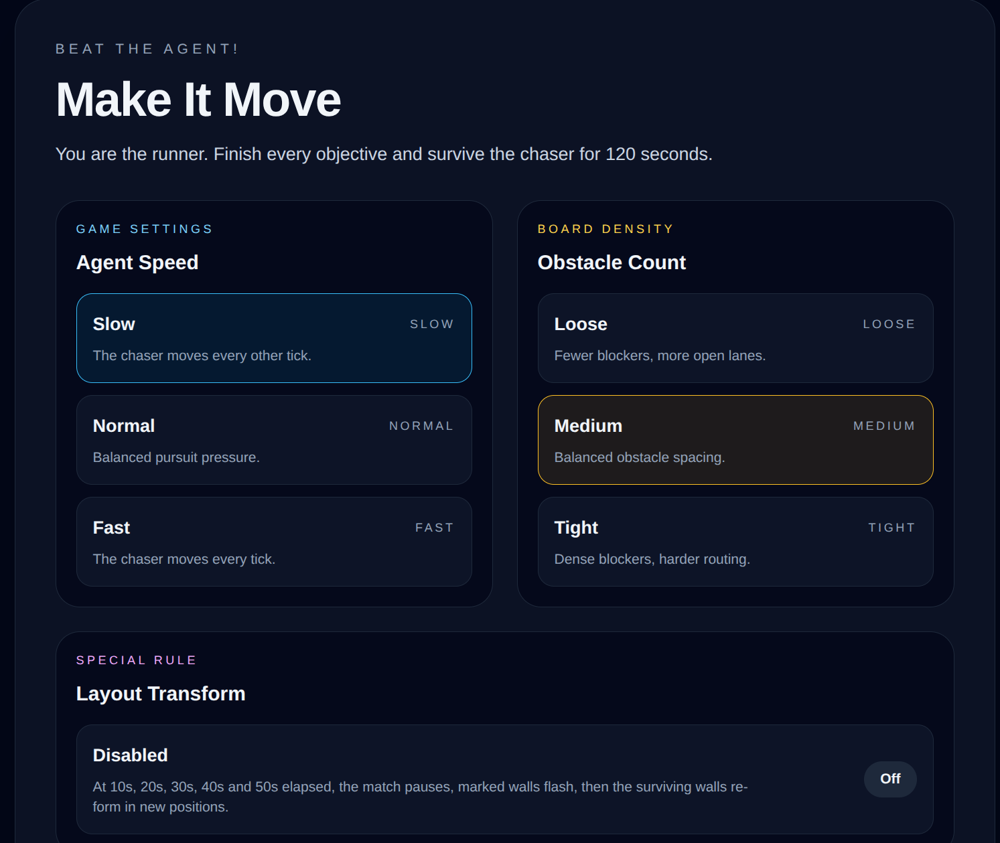

# Make-It-Move (MIMO) v0

## 1. Background 

Make-It-Move is a realtime human-vs-agent chase game built with Next.js and FastAPI.

You play as the **Runner**. The agent plays as the **Chaser**.

Your goal is to finish all task points and survive until the timer ends.

## 2. Core Loop

- Match duration: `120 seconds`
- Runner wins: complete all task points and avoid being caught before time expires
- Chaser wins: catch the runner, or let the timer expire before all tasks are complete
- Controls: `WASD` or arrow keys

## 3. Map Elements 

- `Tasks`: gold cells that the runner must complete
- `Walls`: barriers placed **between** tiles; they block movement and line of sight
- `Swamps`: green cells; stepping into them causes a temporary stop

## 4. Chaser Logic

- The chaser does **not** have full-map knowledge
- It can only directly track the runner when the runner is within the configured vision radius
- When vision is lost, the chaser moves toward the last seen location
- If it gets stuck, it switches direction and patrols

## 5. Match Events

Each match includes fixed environment changes and guaranteed special events.

### < Fixed timeline >

- `Layout Transform`: `5s`, `35s`, `65s`, `95s`
- `Wall Decay`: `15s`, `30s`, `45s`, `60s`, `75s`, `90s`, `105s`

### < special events >

- Each match schedules `5` special events
- Event types:
  - `Freeze`: the chaser is locked down
  - `Boost`: the chaser gains a speed burst
- Event windows are generated once per match and spread across the full `120s` timeline
- Every special event freezes the match for `4s` and shows a fullscreen popup

## 6. Structure

### < Frontend >

Main UI files:

- `apps/web/src/app/page.tsx`
- `apps/web/src/app/battle/page.tsx`
- `apps/web/src/components/Arena.tsx`
- `apps/web/src/components/ScorePanel.tsx`
- `apps/web/src/components/ControlHint.tsx`

### < Backend >

Main game logic files:

- `apps/api/app/game.py`
- `apps/api/app/main.py`
- `apps/api/app/local_server.py`
- `apps/api/app/rooms.py`

# Run it on your device!

### Docker

```bash
make dev
```

Open:

```text
http://localhost:3000
```

### Local one-command startup

```bash
bash start.sh
```

The startup script will:

- start the API
- start the web app
- open the game stack on local ports

## API Contract

- `GET http://localhost:8000/health`
- `POST http://localhost:8000/matches`
- `WS ws://localhost:8000/ws/matches/{matchId}`

## Python Dependencies

FastAPI requirements are defined in:

```text
apps/api/requirements.txt
```

If FastAPI is not installed, the local startup flow can fall back to the lightweight built-in server.

## Tests

Run backend tests from the repo root:

```bash
make api-test
```

Run frontend type checks:

```bash
npx tsc --noEmit --incremental false -p apps/web/tsconfig.json
```
